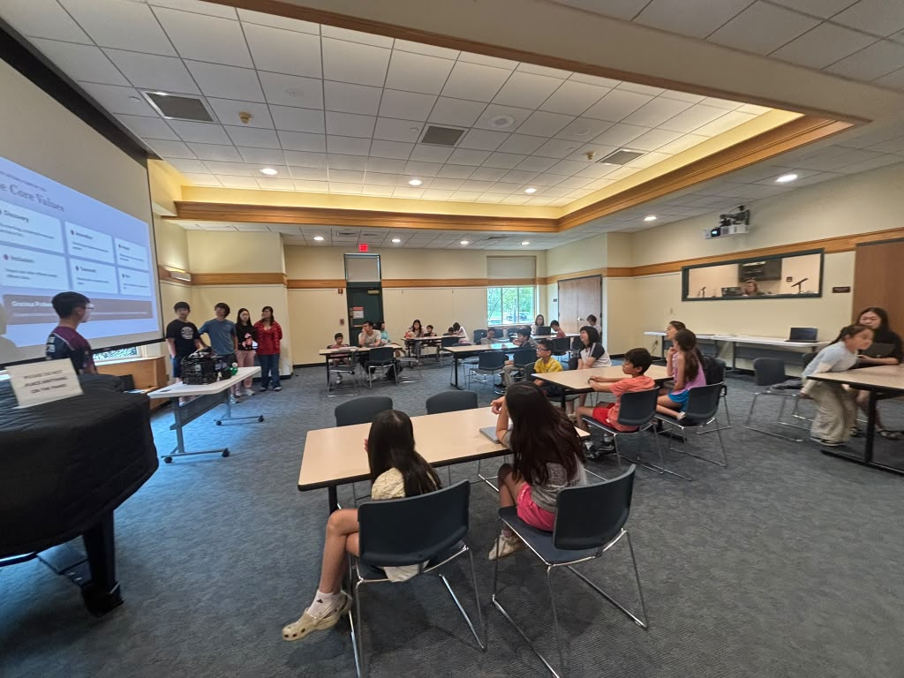
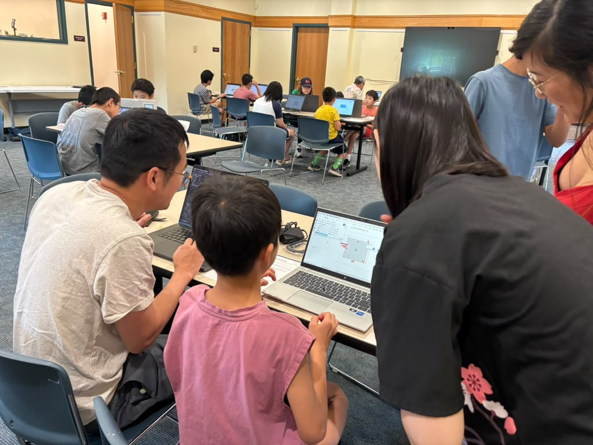
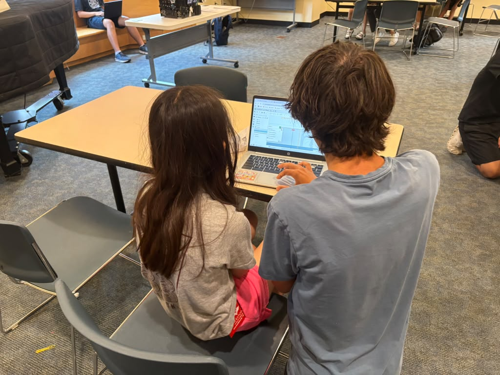

Our summer robotics seminar ran Saturday, August 15, from noon to 3 PM at the Weston Public Library. Free, and no robotics experience needed: you showed up and had fun.

<figure class="post-figures">

<figcaption>A GNCE Onyx mentor presents to the group at the Weston Public Library, the team's competition robot on the table at the front.</figcaption>
</figure>

We opened with what FTC is about and the gist of how a season runs through the year, then got into a small activity that introduces the engineering design process: a paper tower challenge. The objective was to build the tallest structure, watch as it (inevitably) falls over, then work the steps toward fixing it to make it even better.

Most of the time went to CAD. We gave about ninety minutes on Onshape, a website where our ideas take shape. We started by walking everyone through the introduction and getting used to the site, then let students go at their own pace while we offered help and encouragement. Students signed up with their own Onshape accounts, so their files are saved and still theirs.

<figure>

<figcaption>Mentors work through Onshape with students at one table while the rest of the room follows on their own laptops.</figcaption>
</figure>
<figure>

<figcaption>A GNCE Onyx mentor works through Onshape with a student.</figcaption>
</figure>

At the end, we brought out the competition robot for everyone to see. We got close up, inspected every part, and discussed the whats and the whys. Everything was interactive, and students got plenty of chances to explain, wonder, and ask questions all through the seminar. Many stayed after 3 for more questions, comments, and the extra information we had.

The seminar was taught by our very own GNCE Onyx students, who came up through FTC teams that reached Worlds (the big goal) and other premier events with internationally recognized awards.
